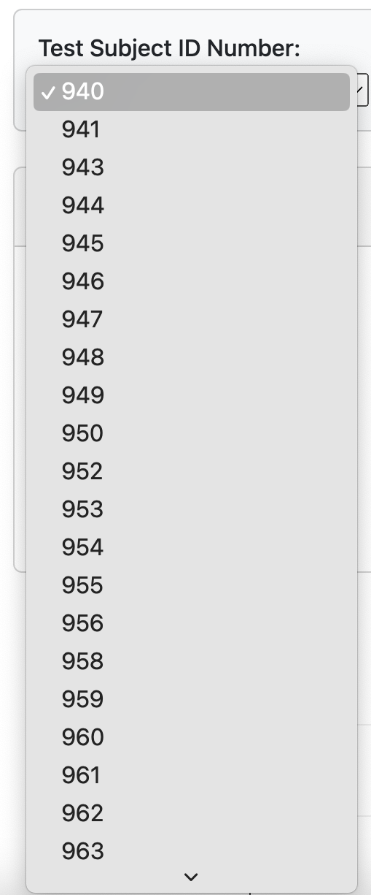
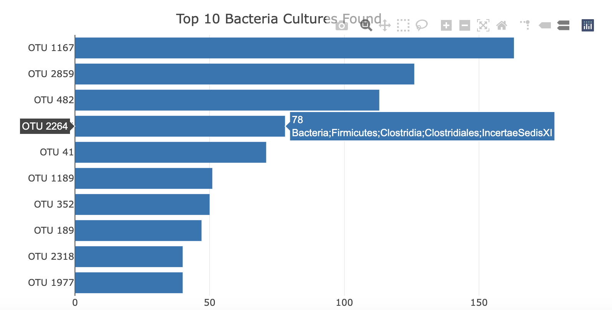
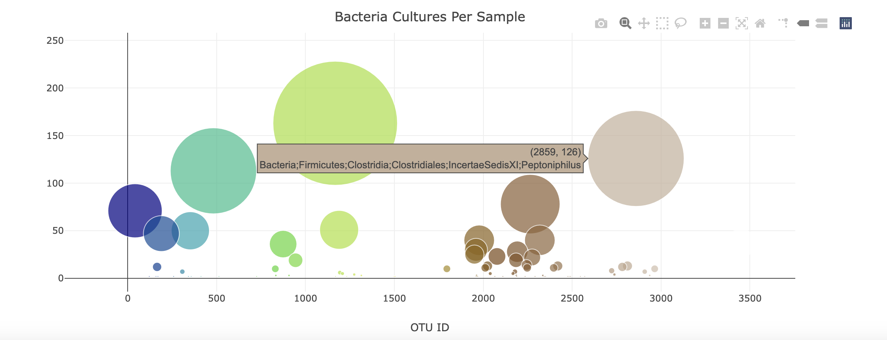
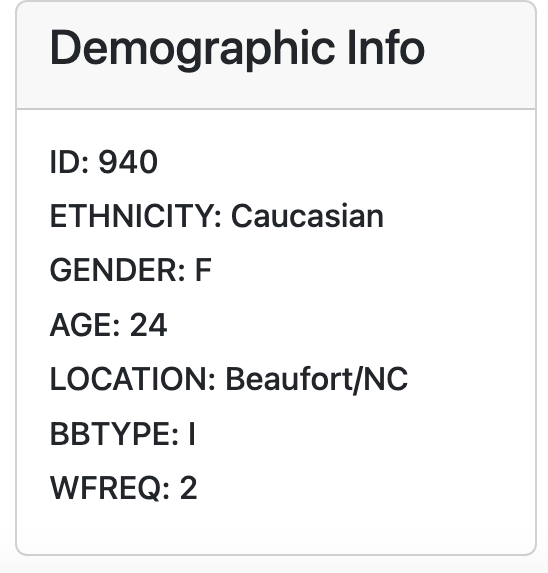
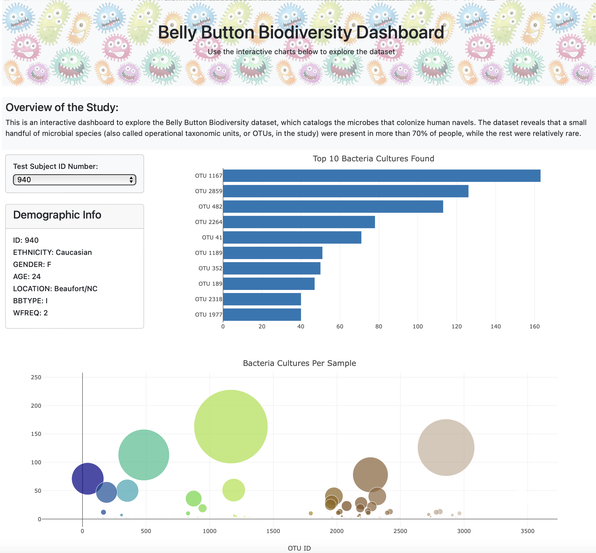

# belly-button-challenge
- Module 14 Challenge
- Steph Abegg

In this assignment, we were asked to build an interactive dashboard to explore the Belly Button Biodiversity dataset, which catalogs the microbes that colonize human navels. The dataset reveals that a small handful of microbial species (also called operational taxonomic units, or OTUs, in the study) were present in more than 70% of people, while the rest were relatively rare.

## GitHub Pages

I deployed my repository to GitHub Pages. The interactive dashboard I created in this assignment can be displayed and interacted with at the following link:

https://sabegg2.github.io/belly-button-challenge/

## The Elements of the Dashboard

The elements of the dashboard are:

(1) A dropdown list of Test Subject ID numbers. This allows different test subjects to be selected. All of the plots and metadata update when a new test subject is selected.

(2) A horizontal bar chart that displays the top 10 bacterial cultures (identified by otu_id) found in the test subject. The length of the bars are the sample values, representative of the amount of the respective culture detected. When the mouse hovers over a bar, more information is given about the bacterial culture (the sample value and the lowest taxonomic level of Bacteria/Archaea found).

(3) A bubble chart that displays each sample, ordred horizontally and colored by otu_id number. The marker size and vertical position are the sample value, representative of the amount of the respective culture detected. When the mouse hovers over a bubble, more information is given about the bacterial culture (the sample value and the lowest taxonomic level of Bacteria/Archaea found).

(4) A box displaying the the individual's demographic information, such as id number, ethnicity, gender, age, location, belly button type (I=innie, O=outie), and washing frequency (belly button scrubs per week). 

Here is what the interactive dashboard looks like:

For fun, I put an image of cute little microbes in the header (this was done by putting a background image in the 
 for the header, using the code style="background-image: url('images/microbes.png');"). I also added a description below the header.

## Libraries used

I used the D3 library to read in samples.json.

I refered to the Plotly.js documentation when building the bar chart and bubble chart.
